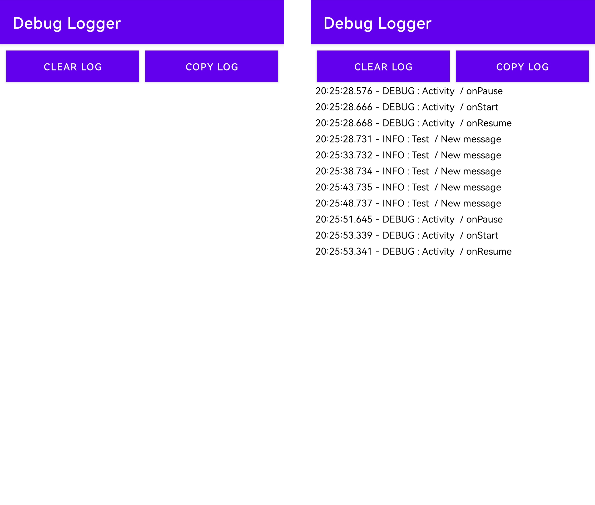

# DebugLogger

[](https://github.com/Japskiddin/DebugLogger/actions/workflows/check_build.yml)
[](https://github.com/Japskiddin/DebugLogger/actions/workflows/release.yml)

Simple library that can log events and display it inside application.



## Usage

Initialize **LogManager** instance in your application and enable it. For example, inside
Application class.

Using Java:

```java
LogManager.getInstance().setEnabled(true);
```

Using Kotlin:

```kotlin
LogManager.getInstance().enabled = true
```

To log an event, you can use the following methods, which log the event to the appropriate channel.

Using Java:

```java
LogManager.getInstance().logInfo("Sample Tag","Info event");
        LogManager.getInstance().logWarn("Sample Tag","Warning event");
        LogManager.getInstance().logDebug("Sample Tag","Debug event");
        LogManager.getInstance().logError("Sample Tag","Error event");
```

Using Kotlin:

```kotlin
LogManager.getInstance().logInfo("Sample Tag", "Info event")
LogManager.getInstance().logWarn("Sample Tag", "Warning event")
LogManager.getInstance().logDebug("Sample Tag", "Debug event")
LogManager.getInstance().logError("Sample Tag", "Error event")
```

To display the logs in the application, you need to add a view to any convenient place.

```xml

<io.github.japskiddin.debuglogger.ui.DebugLogger android:id="@+id/debug_logger"
    android:layout_width="match_parent" android:layout_height="160dp" />
```

After that, the view will display all the logs sent via the LogManager as shown in the screenshot.
